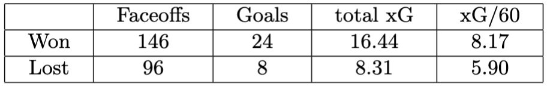
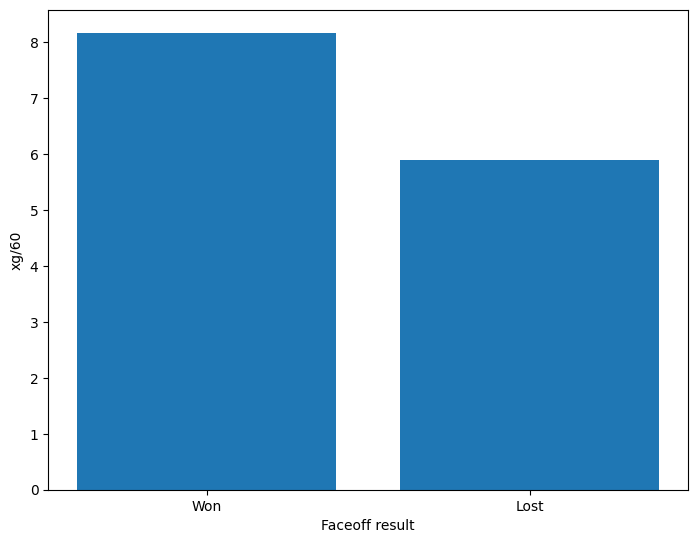

## The Impact of Winning Faceoffs on Expected Goals (xG) in Power plays: An Analysis of 2020-2021 SHL Season Data

    

### Introduction
Over the last decade, the overall efficiency of power plays in ice hockey has been on the rise, suggesting an increasing importance placed on this aspect of the game. Every power play starts with a faceoff, making it a crucial play as it provides a chance to gain possesion of the puck. Teams that can effectively take advantage of their power play opportunities are more likely to score goals and ultimately win games. As a result, teams are constantly seeking ways to improve their power play. 

In this context, analyzing the impact of winning faceoffs during power play situations can provide valuable insights for teams seeking to enhance their power play performance. By understanding the effect that winning faceoffs has on a team's expected goals (xG) during power plays, teams can make more informed decisions about their approach to power play 

### Research question
- How does winning a faceoff impact the expected goals during power plays in ice hockey?

### Background:
A previous study on faceoffs in the NHL has shown that faceoffs can have a notable impact on a teams success over a full season (Schuckers, Tom Pasquali and Jim Curro 2012). Increasing the faceoff win rate from 50% to 60% is equivalent to 12 goals and two more wins over a season according to their results. They also found that it takes 40.9 faceoff wins in the power play to gain a goal differential and 76.5 faceoff wins during even strength, suggesting it is more important to win a faceoff during a power play.

To analyze the effect of the faceoff result, it must be defined what events should be attributed as a result of the faceoff. Compared to the previous study by Schuckers, Pasquali and Curro, this study do not limit the impact of the faceoff to 20 seconds since puck possesion is switching far less often during power plays compared to when teams play with equal strength. In this report, a simplistic approach has been chosen where all events in a game sequence are attributed as a result of the faceoff. A game sequence has been defined as all power play events that happen between the current faceoff and the next power play faceoff. If the faceoff is the last faceoff during the power play, all events until the teams play with equal strength are included in the game sequence.

The event data used in this research was acquired from Sportlogiq, as provided by LINHAC. The dataset covers 20 games from the 2020-2021 SHL season and contains over 76,000 rows, each representing a distinct game event. Although the dataset captured 22 attributes for each event, only a subset of these attributes were deemed relevant to the research question and were therefore analyzed.

### Method
The provided dataset was loaded into Python using the Pandas library. The dataset was then divided into power play game seqeunces according to the definition in the background of the report. All game sequences were then filtered so that only the expected goals of the power play team were included in the game sequences. The game sequences were then divided into two groups based on the result of the faceoff. 

Data from these two groups were then collected, which included the sum of all goals, expected goals and total time. This allowed for calculation of the expected goals per 60 minutes (xG/60).

### Results
A total of 244 faceoffs were analyzed during 135 penalties. Of these, 148 faceoffs were won and 96 were lost by the power play team. When the power play team won the faceoff, 24 goals were scored with an expected goals (xG) of 16.44, resulting in an expected goals per 60 minutes (xg/60) of 8.17. In contrast, when the power play team lost the faceoff, 8 goals were scored with an expected goals (xG) of 8.31, resulting in 5.90 xG/60. 

    

    <em>Table 1. Impact on goal scoring and expected goals during power play based on faceoff
result</em>

The results indicate a significant difference in the xG per 60 minutes when comparing faceoff wins and losses. Winning a faceoff during a power play situation led to an increase in xG per 60 minutes by 38% compared to losing the faceoff (8.17 xG/60  vs. 5.90 xG/60). Noticeably, approximately 46% more goals were scored compared to expected goals after winning a faceoff. 

    

    <em>Fig. 1. Expected goals per 60 minutes based on faceoff result
</em>

### Discussion
The findings of this report further supports the importance of winning faceoffs during power play situations. With a 38% increase in xG/60, it is evident that winning a faceoff during a power play leads to a significant increase of the expected goals. Thus, having a great faceoff player on the ice during a power play is highly important. 

This study suggests that teams having weak faceoff statistics in their power play should potentially prioritize improving their faceoff strategies rather than other components of their power play game.

It is important to acknowledge that the dataset used in this study covers a relatively small sample size of only 20 games. Therefore, the findings should be interpreted with caution. Future research with a larger dataset over several seasons could help to confirm or refute the findings of the report. The definition of game sequences used in this study is also very simplistic, and more advanced methods could be used to define which events should be attributed as a result of a faceoff more accurately. For example, if the puck switches possesion between teams or if the puck leaves the offensive zone, then the result of the faceoff might not matter that much anymore. 

Despite these limitations, the findings of this report provide valuable insights into the impact of winning faceoffs that can be used by teams to improve their power play efficiency and ultimately win games.

### References
[1. Schuckers, M., Pasquali, T., Curro, J. : An Analysis of NHL Faceoffs. (2012)](https://www.statsportsconsulting.com/wp-content/uploads/FaceoffAnalysis12-12.pdf)
